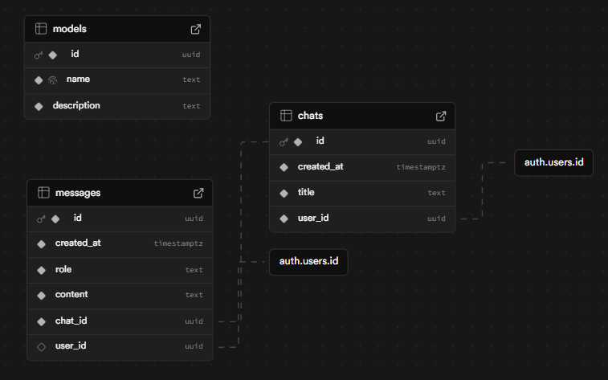

# Nexia AI

A free, advanced AI chat platform supporting multiple AI models for intelligent conversations and image generation.

## Features

- 🤖 **Multi-Model Support**: Chat with various AI models including OpenAI
- 🎨 **Image Generation**: Generate images using Pollination AI
- 💬 **Real-time Chat**: Smooth, responsive chat interface
- 🌓 **Dark/Light Mode**: Toggle between themes
- 📱 **Mobile Responsive**: Works seamlessly on all devices
- 👤 **User Authentication**: Sign up/in with email or Google
- 💾 **Chat History**: Save and manage your conversations
- 🔄 **Message Regeneration**: Retry failed responses
- 📝 **Markdown Support**: Rich text formatting in messages

## Tech Stack

- **Frontend**: Next.js 14, React, TypeScript
- **Styling**: Tailwind CSS, Radix UI
- **Authentication**: Supabase Auth
- **Database**: Supabase (PostgreSQL)
- **AI Integration**: Pollination AI API
- **State Management**: Zustand
- **Form Handling**: React Hook Form + Zod validation

## Getting Started

### Prerequisites

- Node.js 18+
- npm or yarn
- Supabase account

### Installation

1. Clone the repository:

```bash
git clone https://github.com/romankarbivskyi/nexia-ai.git
cd nexia-ai
```

2. Install dependencies:

```bash
npm install
```

3. Set up environment variables:

```bash
nano .env
```

Fill in your environment variables:

```env
NEXT_PUBLIC_SUPABASE_URL=your_supabase_url
NEXT_PUBLIC_SUPABASE_ANON_KEY=your_supabase_anon_key
```

4. Run the development server:

```bash
npm run dev
```

5. Open [http://localhost:3000](http://localhost:3000) in your browser.

## Database Schema

The application uses Supabase with the following main tables:

- **users**: User profiles and authentication
- **chats**: Chat conversations
- **messages**: Individual chat messages
- **models**: Available AI models



## Project Structure

```
src/
├── app/                 # Next.js app router
│   ├── (auth)/         # Authentication pages
│   ├── (chat)/         # Chat interface
│   └── globals.css     # Global styles
├── components/         # React components
│   ├── ui/            # Reusable UI components
│   └── sidebar/       # Sidebar components
├── actions/           # Server actions
├── hooks/             # Custom React hooks
├── lib/               # Utility functions
├── schemas/           # Zod validation schemas
├── store/             # Zustand state management
├── types/             # TypeScript type definitions
└── utils/             # Helper utilities
```

## Key Components

- **Chat**: Main chat interface with message handling
- **Message**: Individual message component with markdown support
- **Markdown**: Custom markdown renderer with syntax highlighting
- **CodeBlock**: Code syntax highlighting component
- **AppSidebar**: Navigation and chat management
- **ChatInput**: Message input with model selection

## API Integration

The app integrates with:

- **Pollination AI**: For text generation and image creation
- **Supabase**: For authentication and data persistence

## Support

If you encounter any issues or have questions, please open an issue on GitHub.

## Acknowledgments

- [Pollination AI](https://pollinations.ai/) for AI model access
- [Supabase](https://supabase.com/) for backend services
- [Shadcn UI](https://ui.shadcn.com/) for UI components
- [Tailwind CSS](https://tailwindcss.com/) for styling
